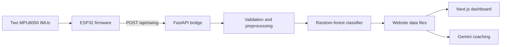
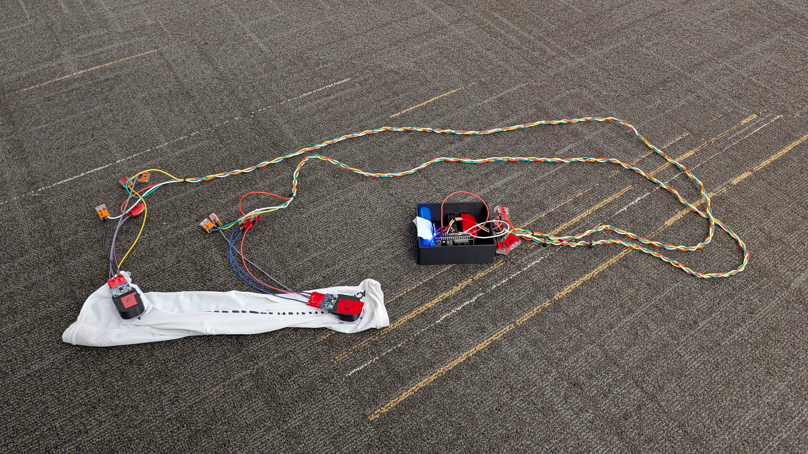

import frontendVideo from '../../../assets/dave-frontend.webm';

**1st Place Overall Winner - BloomKnights Hackathon**

**Links:** [GitHub Repository](https://github.com/its-agn/dave) | [Devpost Submission](https://devpost.com/software/dave-dynamic-acronym-volleyball-evaluator)

<video src={frontendVideo} autoplay loop muted playsinline style="width: 100%; border-radius: 8px; display: block; margin: 0 auto;"></video>

*The DAVE dashboard featuring a 3D swing reconstruction*

DAVE (Dynamic Acronym Volleyball Evaluator) is a wearable hardware motion tracker designed to act as a volleyball coach to help improve accuracy and form.

---

## System Architecture

To get quick feedback of a volleyball swing, we offloaded the kinematic reconstruction and machine learning inference from the wearable to a separate FastAPI server. This architecture blended low-level embedded hardware with a modern AI. We had three distinct parts: physical data capture, backend processing, and frontend visualization.

### Hardware & Electronics

*The arm sleeve with attached IMU sensors and ESP32 microcontroller*

The wearable was driven by an ESP32 Dev Kit. It interfaced with two MPU6050 IMUs positioned on the user's forearm and bicep. The embedded firmware actively calibrates both IMUs, detects swings through velocity thresholds and records telemetry at 200 samples per second.

### Data Pipeline & Machine Learning

Once the physical motion is captured, the ESP32 posts a JSON packet to the Python/FastAPI backend. The data is validated and reconstructed into the absolute positions of the shoulder, elbow, and wrist. The data is passed to the trained Random-Forest classifier to evaluate the swing.

### The Dashboard & AI Coaching

The final processed data files are sent to the dashboard. The frontend shows an interactive 3D replay of the user's swing. In addition, the frame-by-frame processed motion data is sent to the Gemini API for personalized, conversational coaching and feedback.

---

## My Specific Contributions

During the hackathon, I primarily focused on the embedded hardware architecture and networking.
+ **Electronics Integration:** Wired the ESP32 microcontroller and MPU6050 sensors into the wearable.
+ **Network Optimization:** Created the HTTP streaming logic and custom two-pass serialization to overcome microcontroller memory constraints.
+ **Firmware Design:** Handled the initial C++ firmware architecture.

## The Team - BAAA
This 12-hour build was made possible by an incredible team of Computer Science and Mechanical Engineering students:
+ [Brandon Stile](https://www.linkedin.com/in/brandon-stile/) - Frontend & Gemini API Integration
+ [Alexander Nardi](https://linkedin.com/in/alexander-nardi/) - MLOps, Data Processing & Communication
+ [Aiden O'Conner](https://linkedin.com/in/aidenoconnor55/) - Hardware Design & Sensor Fusion Implementation
+ [Adam Brandt](https://linkedin.com/in/adam-k-brandt) - Embedded Electronics & Networking