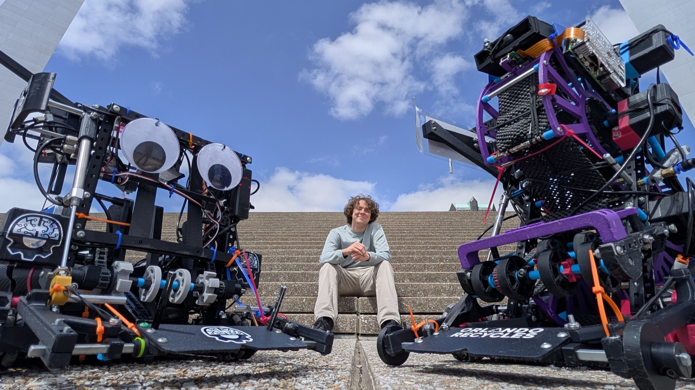
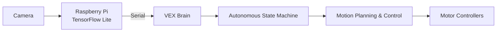

import daydreamLogo from "../../../assets/daydream_logo.webp";

Robotics and autonomous systems have been one of my primary interests since joining my first robotics team in high school. I initially focused on mechanical design but as I transitioned into university-level robotics I shifted toward embedded systems, controls, and autonomous robotics.

## Daydream Robotics

In August 2025, I joined [Daydream Robotics](https://www.instagram.com/daydreamvexu/), which is one of the [VEXU](https://www.vexrobotics.com/v5/competition/vurc) robotics competition teams within the [Robotics Club of Central Florida (RCCF)](https://rccf.club) at the [University of Central Florida](https://ucf.edu). VEX U is the university-level of the VEX V5 robotics competition where each season, a completely new game is introduced, requiring teams to design, build, and program entirely new robots to solve a unique set of challenges.

I joined the software team, where I focused on developing the robot's autonomous systems. Throughout the season my work ranged from integrating embedded computer vision on a [Raspberry Pi](https://www.raspberrypi.com/) to developing nonlinear trajectory-following algorithms used during autonomous operation.

## System Architecture

Although each season requires a completely new robot, the software system stays mostly consistent. While the specific implementation evolves from year to year the software is generally organized into independent subsystems responsible for perception, movement, and decision making.

The diagram below shows the architecture of the 2025-2026 robot, which used a Raspberry Pi running [TensorFlow Lite](https://www.tensorflow.org/lite/) to perform vision inference before sending the results to the VEX brain over a custom serial protocol.

## Embedded Vision

Our 2025-2026 robot used a Raspberry Pi running an embedded Tensorflow Lite object detection model. The Raspberry Pi detected game elements and transmitted their locations to the VEX brain, allowing for autonomous paths to react to the current field condition. My work focused on developing the software pipeline that handled camera capture, model inference, and data communication with the robot. 

- Raspberry Pi Integration
- TensorFlow Lite
- Serial Communication
- Performance & Reliability

## Motion Planning & Control

### Odometry

### PID

### Pure Pursuit

## Challenges

## Lessons Learned