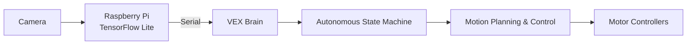

import daydreamLogo from "../../../assets/daydream_logo.webp";

Robotics and autonomous systems have been one of my primary interests since joining my first robotics team in high school. I initially focused on mechanical design but as I transitioned into university-level robotics I shifted toward embedded systems, controls, and autonomous robotics.

## Daydream Robotics

In August 2025, I joined [Daydream Robotics](https://www.instagram.com/daydreamvexu/), which is one of the [VEXU](https://www.vexrobotics.com/v5/competition/vurc) robotics competition teams within the [Robotics Club of Central Florida (RCCF)](https://rccf.club) at the [University of Central Florida](https://ucf.edu). VEX U is the university-level of the VEX V5 robotics competition where each season, a completely new game is introduced, requiring teams to design, build, and program entirely new robots to solve a unique set of challenges.

I joined the software team, where I focused on developing the robot's autonomous systems. Throughout the season my work ranged from integrating embedded computer vision on a [Raspberry Pi](https://www.raspberrypi.com/) to developing nonlinear trajectory-following algorithms used during autonomous operation.

## System Architecture

Although each season requires a completely new robot, the software system stays mostly consistent. While the specific implementation evolves from year to year the software is generally organized into independent subsystems responsible for perception, movement, and decision making.

The diagram below shows the architecture of the 2025-2026 robot, which used a Raspberry Pi running [TensorFlow Lite](https://www.tensorflow.org/lite/) to perform vision inference before sending the results to the VEX brain over a custom serial protocol.

## Embedded Vision

Our 2025-2026 robot used a Raspberry Pi running an embedded TensorFlow Lite object detection model. The Raspberry Pi detected game elements and transmitted their locations to the VEX Brain, allowing for autonomous paths to react to the current field condition. 

My work focused on developing the software pipeline that handled camera capture, model inference, and serial communication between the Raspberry Pi and the VEX Brain.

## Motion Planning & Control

The robot's autonomous movement involves localization, feedback control, and nonlinear tracking. I designed a modular motion control framework that separates trajectory tracking from path execution. This architecture allows for multiple controllers to be developed, tested, and interchanged with minimal changes to the rest of the autonomous system.

### Odometry

To navigate autonomously, the robot must know its position on the field. Unlike GPS navigation, indoor robots require estimating position from onboard sensors.

Our robots use a set of two passive odometry wheels to track the robots lateral movements. Additionally an IMU is used to estimate the orientation of the robot at all times. By combining the data from the odometry wheels and IMU the robot is able to estimate its absolute position on the field.

### PID

PID controllers are used throughout the robot to provide closed-loop control. They are primarily used for controlling the robot's heading during turns and other rotational movement. We also used to use them for lateral movement but stopped in favor of nonlinear trajectory-following controllers while PID remained responsible for regulating in-place turns.

### Pure Pursuit

Pure Pursuit is a nonlinear trajectory-following algorithm that computes a steering command by continuously targeting a point a set distance ahead of the robot along the desired path. This allows the robot to smoothly follow curved paths rather than driving between set waypoints.

I implemented a custom version of Pure Pursuit with an adapative lookahead distance and motion profiling to improve the path following accuracy through tight turns and during the final approach of the end of a path. The lookahead distance would change based on the speed the robot was traveling which was affected by the curvature of the path.

### Ramsete

Ramsete is a nonlinear trajectory-tracking controller that uses the robot's dimensions to minimize position and heading error. After implementing Pure Pursuit, I began experimenting with a Ramsete controller in an effort to try alternative tracjectory-tracking algorithms. The goal was to see if other controllers could further improve path-following accuracy, especially through tighter turns where Pure Pursuit began to show some limitations. 

My implementation extends the standard controller with features such as reverse path tracking, configurable lookahead sampling, and curvature-based velocity limiting. While it is not currently our primary competition controller, it remains part of the motion control stack for testing and future development.

## Serial Communication
**The Quest for Proper Data Transmission**

Reliable communication between the Raspberry Pi and the VEX Brain proved to be one of the more challenging aspects of the vision system. The easiest communication method we could find with the VEX brain was using serial. We chose this because it’s low level and fast. We found out that the VEX brain redirects stdin and stdout to its serial port so we utilized that for communication.

### Attempt 1: Initial Request/Response Protocol

Originally we started out with a three way handshake method. The VEX brain would send a request message to the RPi. The RPi would then get the latest frame, run it through the model, parse the output, and return all the objects. When it returned all objects, it would first send a message with the number of objects found in the frame, then send each object one by one in their own message. Afterwards, the VEX brain would respond back to the RPi to confirm it received the frame data. This approach was much slower than we expected. This was due to all the messages back and forth and also waiting for the model to run.

### Attempt 2: Streaming Everything

For speed we decided to switch to a stream method. Essentially, the RPi is constantly running the model, and sending the data to the VEX brain. The VEX brain would never send any data to the RPi. Instead the VEX brain would just constantly read from serial. We also changed it so that the pi sends the data of all objects in a one line message instead of a separate message for each object. This method was a lot faster, but also turned out to be too fast for the VEX brain. When reading from serial, the oldest unread line is retrieved. The problem was that the RPi would flood that unread buffer faster than the VEX brain could read from it. This caused the VEX brain to be reading older frames as time went on instead of reading the newest frame. Because of limitations with the serial implementation we could not read the most recent line, so we were forced to abandon this method.

### Final Design

Our current method is a combination of the two. The RPi now only responds the closest object of each type instead of all objects in the frame. This helps reduce the amount of data we are moving across serial speeding communication. The VEX, will regularly request the latest frame data from the RPi by sending a specified request message. The RPi is constantly checking for any messages from the VEX brain. If a frame has not been processed in the last 0.5 seconds, it will take a break from checking to process a new frame and store its parsed output. 