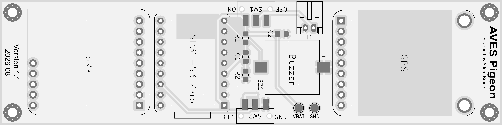
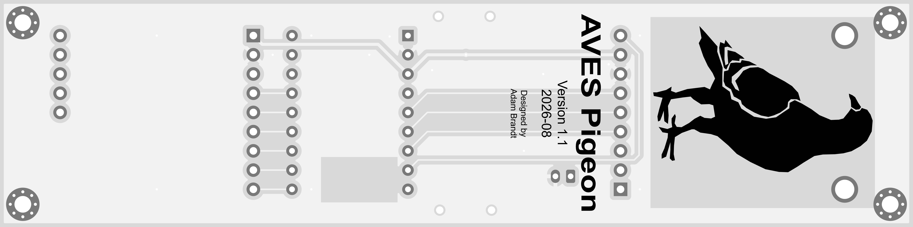

**A compact LoRa and GPS telemetry module designed for high-power model rockets**

**Links:** [GitHub Repository](https://github.com/adkadt/aves/tree/main/pigeon)

*Version 1.1 of the PCB*

Pigeon is a GPS tracking and ground station system built for high-power model rockets. Recovering rockets after flight can be difficult, especially in windy conditions where they may drift hundreds or even thousands of feet from the launch site. Pigeon addresses this problem by transmitting the rocket's live GPS coordinates over a long-range LoRa link down to the ground station allowing for its location to be monitored throughout flight and recovery.

## Design

Pigeon combines custom hardware with embedded firmware to create a compact, flight-ready GPS tracking system. The board is built around a Waveshare ESP32-S3 Zero, which manages sensor communication and radio transmission. Position data is provided by an Adafruit Ultimate GPS Breakout, while an Adafruit RFM95W LoRa Transceiver Breakout enables long-range LoRa communication with the ground station.

To improve reliability and reduce wiring, these components are soldered onto a custom PCB designed in KiCad. The board also includes a status LED, a piezo buzzer, battery connections, and a hardware mode switch for selecting between onboard GPS tracker and ground station operating modes.

## Results

Version 1.0 established the core hardware, integrating GPS, LoRa, and the ESP32-S3 onto a custom PCB. Based on lessons learned during the initial design, Version 1.1 adds a hardware mode switch, allowing the same board with the same hardware, to function as either the onboard GPS tracker or the ground station. Firmware development is currently focused on GPS acquisition and LoRa communication.

## Future Work

- Test the latest PCB revision.
- Finish the firmware for the GPS tracker and ground station.
- Test long-range capabilities.